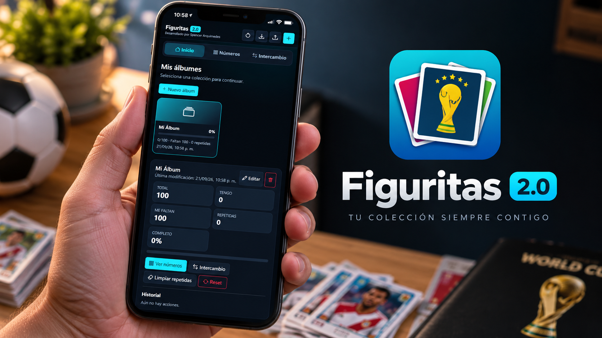
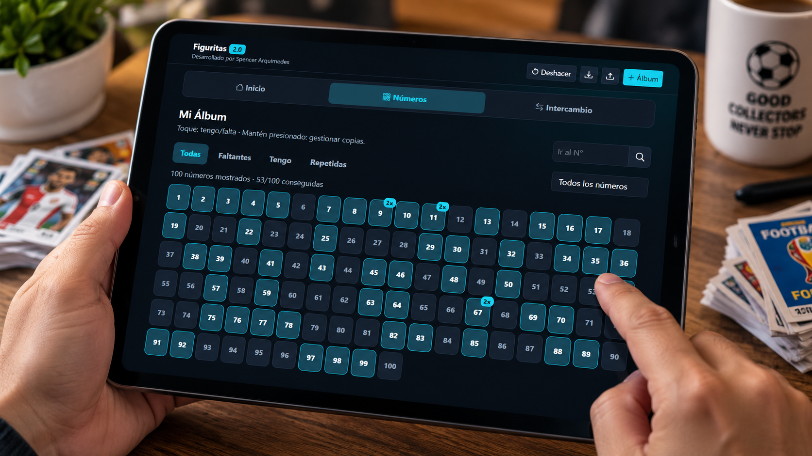
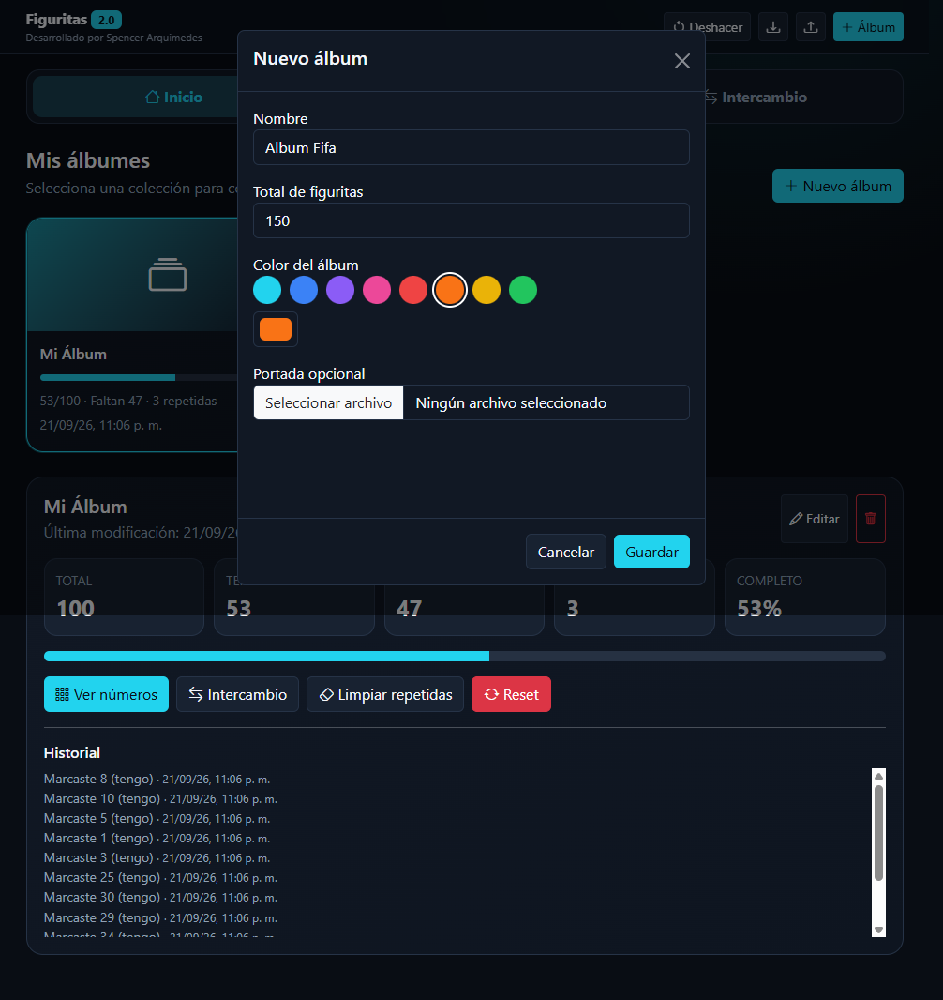

# Figuritas 2.0

Aplicación web local para organizar álbumes de figuritas, registrar copias, controlar faltantes y preparar listas de intercambio.

## Características

- Múltiples álbumes independientes.
- Cantidad real de copias y figuritas repetidas.
- Vista de intercambio con listas de faltantes y repetidas.
- Copiar lista y compartir intercambio por WhatsApp.
- Navegación por rangos y salto directo a un número.
- Biblioteca visual de álbumes con portada, color y progreso.
- Color de interfaz independiente para cada álbum.
- Estadísticas de colección, historial y opción de deshacer.
- Diseño responsive, modo oscuro y Bootstrap Icons.
- Exportación e importación de respaldos JSON de Figuritas 2.0.
- Renderizado optimizado para álbumes grandes.

## Capturas



## Uso

No requiere instalación, servidor, base de datos ni API key.

1. Descarga o clona el repositorio.
2. Abre `index.html` en un navegador moderno.
3. Crea tu primer álbum y comienza a marcar tus figuritas.

Los datos se almacenan localmente en el navegador mediante `localStorage`.



## Estructura

```text
figuritas/
├── index.html
├── app.css
├── app.js
├── screenshots/
├── .gitignore
├── LICENSE
└── README.md
```

## Privacidad

Figuritas 2.0 funciona localmente. No incluye backend, cuentas de usuario ni una base de datos remota. La información de los álbumes permanece en el almacenamiento local del navegador, salvo las acciones que el propio usuario realice para exportar o compartir una lista de intercambio.

## Versión

**2.0**

Esta versión no incluye el antiguo sistema de enlaces públicos de álbumes, modo compartido de solo lectura, PWA ni compatibilidad específica con respaldos de Figuritas 1.x.

## Licencia

Este proyecto se distribuye bajo la **Licencia MIT**. Consulta el archivo `LICENSE` para más información.
